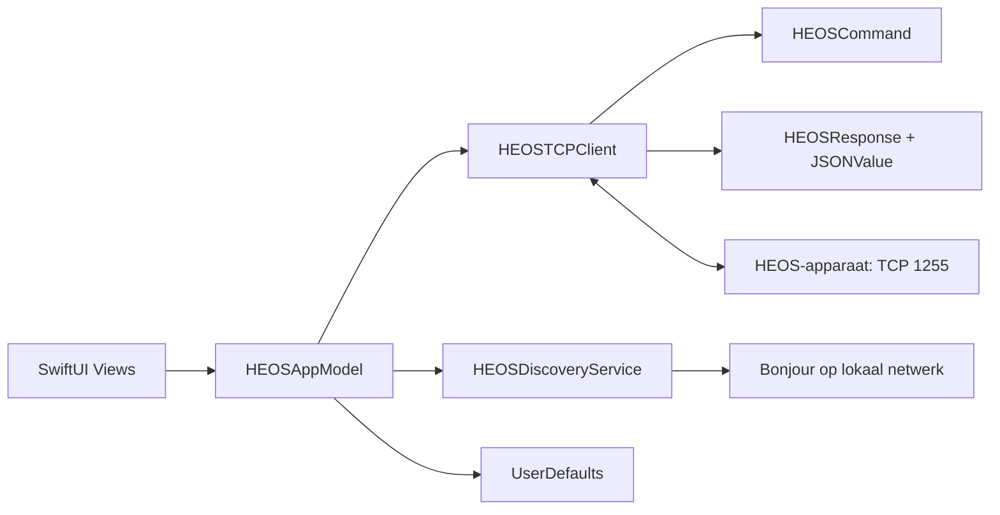

# HEOS Menu Bar bouwen vanaf nul

Deze handleiding legt stap voor stap uit hoe je met Xcode, Swift en SwiftUI een native macOS-menubalkapp maakt die HEOS-spelers ontdekt en bedient. Het doel is niet alleen dat de code werkt, maar vooral dat je begrijpt **waarom** ieder bestand, iedere Xcode-instelling en iedere Swift-constructie nodig is.

De uiteindelijke app kan:

- als icoon in de macOS-menubalk draaien;
- automatisch HEOS-apparaten op het lokale netwerk vinden;
- via TCP met de HEOS CLI op poort `1255` verbinden;
- JSON-antwoorden van HEOS verwerken;
- alle spelers binnen het HEOS-systeem ophalen;
- volume en mute per speler bedienen;
- spelers met een drag-handle in een eigen, blijvende volgorde zetten;
- wijzigingen vanuit andere HEOS-apps live ontvangen;
- automatisch opnieuw verbinden;
- instellingen bewaren;
- spelers alleen binnen deze app uitschakelen;
- een apart, altijd-bovenliggend instellingenvenster tonen.

Deze tekst hoort bij de werkende broncode in deze repository. Je kunt dus na elk hoofdstuk het genoemde bestand openen en de complete implementatie bekijken.

---

## 1. Wat je gaat leren

Tijdens dit project komen de belangrijkste onderdelen van een native macOS-app samen:

1. Een Xcode-project, target, scheme en app-bundle begrijpen.
2. De levenscyclus van een SwiftUI-app begrijpen.
3. Een interface opbouwen uit kleine SwiftUI-views.
4. App-state centraal beheren met `ObservableObject` en `@Published`.
5. Asynchrone netwerkcommunicatie uitvoeren met `Network.framework`.
6. Een regelgebaseerd TCP-protocol verwerken.
7. JSON decoderen met `Decodable`.
8. Bonjour-services vinden met `NetServiceBrowser`.
9. App Sandbox, entitlements en privacyverklaringen configureren.
10. Instellingen bewaren met `UserDefaults`.
11. AppKit gebruiken voor macOS-gedrag dat SwiftUI niet rechtstreeks aanbiedt.
12. Gedrag automatisch testen met XCTest.
13. Wijzigingen veilig beheren met Git en GitHub.

---

## 2. Benodigdheden

Je hebt nodig:

- een Mac;
- Xcode;
- macOS 13 Ventura of nieuwer als deployment target;
- een HEOS-speler of Denon/Marantz-apparaat met HEOS;
- de Mac en het HEOS-apparaat op hetzelfde lokale netwerk;
- basiskennis van variabelen, functies en `if`-statements is handig, maar niet vereist.

Open Xcode een keer voordat je begint. Xcode installeert dan eventueel nog aanvullende componenten.

Controleer vanuit Terminal welke Swift-versie beschikbaar is:

```sh
swift --version
```

Controleer het actieve Xcode-pad:

```sh
xcode-select -p
```

Als Command Line Tools naar een andere installatie wijzen, kun je voor één opdracht expliciet Xcode kiezen:

```sh
DEVELOPER_DIR=/Applications/Xcode.app/Contents/Developer swift --version
```

---

## 3. Eerst het Xcode-mentale model

Een beginnende verwarring is het verschil tussen een Swift-bestand en een Xcode-project.

### 3.1 `.swift`

Een bestand met de extensie `.swift` bevat broncode. Eén app bestaat meestal uit tientallen of honderden Swift-bestanden. Een los Swift-bestand weet niet automatisch:

- welke andere bestanden bij de app horen;
- voor welk Apple-platform het wordt gebouwd;
- welke resources moeten worden meegenomen;
- welke sandboxrechten nodig zijn;
- hoe de app moet worden ondertekend.

### 3.2 `Package.swift`

`Package.swift` beschrijft een Swift Package. Dat is uitstekend voor bibliotheken, commandlineprogramma's en tests. Dit project houdt een package-configuratie bij zodat de protocoltests eenvoudig met `swift test` kunnen draaien.

Een Swift Package alleen is minder praktisch voor deze app, omdat een volwaardige macOS-app ook een app-bundle, Info.plist, entitlements, signing en assetcatalogus nodig heeft.

### 3.3 `.xcodeproj`

`HEOSMenuBar.xcodeproj` is het native Xcode-project. Het bevat verwijzingen naar:

- alle bronbestanden;
- alle resources;
- build settings;
- targets;
- schemes;
- signing-instellingen;
- de Info.plist;
- entitlements.

De `.xcodeproj` bevat dus niet alle code zelf. Het is de bouwbeschrijving waarmee Xcode van de losse bestanden een echte `.app` maakt.

### 3.4 Target

Een **target** beschrijft één bouwproduct. In dit project heet het target `HEOSMenuBar` en is het resultaat `HEOSMenuBar.app`.

Een groter project kan meerdere targets hebben, bijvoorbeeld:

- de macOS-app;
- een iPhone-app;
- een testbundle;
- een helperproces.

### 3.5 Scheme

Een **scheme** bepaalt welk target Xcode bouwt, runt, test en archiveert. Kies bovenin Xcode:

- scheme: `HEOSMenuBar`;
- destination: `My Mac`.

### 3.6 Build configuration

De meest gebruikte configuraties zijn:

- **Debug**: voor ontwikkelen, breakpoints en extra debug-informatie;
- **Release**: voor distributie en optimalisatie.

### 3.7 App-bundle

Een macOS-app is technisch een map met de extensie `.app`. Daarin zitten onder andere:

```text
HEOSMenuBar.app/
└── Contents/
    ├── Info.plist
    ├── MacOS/HEOSMenuBar
    └── Resources/
        ├── AppIcon.icns
        └── Assets.car
```

Finder toont deze map als één app-icoon.

---

## 4. Een leeg macOS-project aanmaken

Als je dit project helemaal opnieuw wilt maken:

1. Open Xcode.
2. Kies **File → New → Project**.
3. Kies bovenaan **macOS**.
4. Kies **App**.
5. Klik **Next**.
6. Vul bijvoorbeeld in:
   - Product Name: `HEOSMenuBar`
   - Team: je eigen Apple Development-team
   - Organization Identifier: bijvoorbeeld `com.jouwnaam`
   - Interface: `SwiftUI`
   - Language: `Swift`
7. Schakel Core Data en tests alleen in als je die direct wilt gebruiken. Tests voegen we in deze handleiding bewust later toe.
8. Sla het project op in een nieuwe Git-map.

Xcode maakt meestal alvast een app-entrypoint en een `ContentView.swift`. Voor een menubalkapp vervangen we die standaardinterface.

### Deployment target instellen

1. Klik links op het blauwe projecticoon.
2. Selecteer onder **TARGETS** het app-target.
3. Open **General**.
4. Zet **Minimum Deployments** op macOS 13.0.

`MenuBarExtra` is beschikbaar vanaf macOS 13.

---

## 5. De projectstructuur maken

Een duidelijke structuur voorkomt dat een groter project onoverzichtelijk wordt. Dit project gebruikt:

```text
HEOSMenuBar.xcodeproj/       Xcode-project
Config/
├── Info.plist               Metadata en privacyverklaringen
└── HEOSMenuBar.entitlements Sandboxrechten
Resources/
├── AppIcon.icns             App-icoon
└── Assets.xcassets/         Menubalkasset en overige afbeeldingen
Sources/HEOSMenuBar/
├── App/                     Startpunt van de app
├── Models/                  Gegevensmodellen
├── Networking/              TCP-transport
├── Protocol/                HEOS-commando's en antwoorden
├── Services/                Bonjour-discovery
├── Store/                   Centrale app-state en logica
└── Views/                   SwiftUI-interface
Tests/HEOSMenuBarTests/      XCTest-tests
```

In Xcode kun je groepen aanmaken met **New Group**. Een gele Xcode-groep is niet altijd automatisch een echte map op schijf. Controleer daarom in de File inspector het pad van een bestand.

Als bestanden al op schijf bestaan:

1. Sleep de map of bestanden naar de Project navigator.
2. Kies **Create groups**.
3. Controleer bij **Add to targets** dat `HEOSMenuBar` is aangevinkt.

Een Swift-bestand dat niet bij het target hoort, wordt niet meegecompileerd.

---

## 6. Architectuur van de app

De app gebruikt een eenvoudige laagverdeling:



De verantwoordelijkheden zijn bewust gescheiden:

- **Views** tekenen de interface en sturen gebruikersacties door.
- **HEOSAppModel** beslist wat de app moet doen.
- **HEOSTCPClient** verzorgt alleen de netwerkverbinding en datastroom.
- **HEOSCommand** vertaalt acties naar protocolregels.
- **HEOSResponse** vertaalt JSON naar Swift-waarden.
- **HEOSDiscoveryService** zoekt apparaten.
- **UserDefaults** bewaart kleine instellingen.

Deze scheiding maakt de code beter leesbaar en testbaar.

---

## 7. Het app-entrypoint en `MenuBarExtra`

Open `Sources/HEOSMenuBar/App/HEOSMenuBarApp.swift`.

Iedere SwiftUI-app heeft precies één type met `@main` dat voldoet aan `App`:

```swift
import SwiftUI

@main
struct HEOSMenuBarApp: App {
    @StateObject private var model = HEOSAppModel()

    var body: some Scene {
        MenuBarExtra {
            MenuBarContentView()
                .environmentObject(model)
                .task { model.start() }
        } label: {
            Image("MenuBarIcon")
                .renderingMode(.template)
                .resizable()
                .scaledToFit()
                .frame(width: 18, height: 18)
        }
        .menuBarExtraStyle(.window)

        Settings {
            SettingsView()
                .environmentObject(model)
        }
    }
}
```

### Wat gebeurt hier?

- `@main` vertelt Swift waar de app begint.
- `App` is het SwiftUI-app-protocol.
- `Scene` beschrijft één of meer vensters of menu-interface-elementen.
- `MenuBarExtra` plaatst een item in de macOS-menubalk.
- `.menuBarExtraStyle(.window)` maakt een rijk SwiftUI-paneel mogelijk in plaats van alleen een klassiek menu.
- `Settings` maakt de officiële SwiftUI-instellingenscene.
- `@StateObject` maakt één langlevend model voor de hele app.
- `.environmentObject(model)` stelt onderliggende views in staat hetzelfde model te gebruiken.
- `.task` start discovery en verbinding wanneer de menucontent voor het eerst verschijnt.

### Waarom `@StateObject` en niet `@ObservedObject`?

De view die eigenaar is van het model gebruikt `@StateObject`. SwiftUI bewaart dat object dan wanneer de view opnieuw wordt opgebouwd.

Een onderliggende view gebruikt:

```swift
@EnvironmentObject private var model: HEOSAppModel
```

Die view maakt het model niet zelf, maar ontvangt het uit de omgeving.

---

## 8. Alleen in de menubalk draaien

Een menubalkapp hoeft geen Dock-icoon en standaard hoofdvenster te tonen. Daarvoor staat in `Config/Info.plist`:

```xml
<key>LSUIElement</key>
<true/>
```

`LSUIElement = true` maakt de app een agent-app:

- geen normaal Dock-icoon;
- geen standaard menubalk met File/Edit/View;
- de app kan wel eigen vensters openen, zoals Settings.

Verwijder je deze sleutel of zet je hem op `false`, dan gedraagt de app zich meer als een gewone macOS-app.

---

## 9. Het menubalkicoon correct maken

Een menubalkicoon is anders dan een kleurrijk app-icoon.

### Template image

macOS kleurt een template image automatisch voor:

- lichte modus;
- donkere modus;
- geselecteerde toestand;
- toegankelijkheidsinstellingen.

Gebruik daarom een zwart symbool op een transparante achtergrond. In de assetcatalogus staat bij `MenuBarIcon.imageset/Contents.json`:

```json
"properties" : {
  "template-rendering-intent" : "template"
}
```

Daarnaast dwingt de SwiftUI-code `.renderingMode(.template)` af.

### Resoluties

Voor een weergave van 18 punten gebruiken we:

- `menubar-icon.png`: 18 × 18 pixels voor 1x;
- `menubar-icon@2x.png`: 36 × 36 pixels voor Retina.

### Veelgemaakte fout: volledig transparant

Een PNG kan correcte afmetingen hebben en toch onzichtbaar zijn als het alphakanaal overal nul is. Controleer daarom niet alleen de witte of zwarte pixels, maar ook transparantie.

Met ImageMagick kun je dat controleren:

```sh
identify -verbose menubar-icon@2x.png
```

De alpha-statistieken moeten zowel transparante als zichtbare waarden bevatten.

Als het icoon na vervanging niet verandert:

1. Stop de app volledig.
2. Kies **Product → Clean Build Folder**.
3. Start de app opnieuw.

---

## 10. Het app-icoon instellen

Dit project gebruikt `Resources/AppIcon.icns`.

Voeg het bestand in Xcode toe aan de groep **Resources** en controleer:

1. Selecteer het app-target.
2. Open **Build Phases**.
3. Kijk onder **Copy Bundle Resources**.
4. Controleer dat `AppIcon.icns` in de lijst staat.

Zet in `Info.plist`:

```xml
<key>CFBundleIconFile</key>
<string>AppIcon</string>
```

De extensie mag hier worden weggelaten. Na het bouwen moet het bestand bestaan als:

```text
HEOSMenuBar.app/Contents/Resources/AppIcon.icns
```

macOS en Finder cachen app-iconen. Een correct gebouwde app kan daardoor tijdelijk nog een oud icoon tonen.

---

## 11. App Sandbox en netwerktoegang

macOS-apps kunnen in een sandbox draaien. De sandbox beperkt wat een app mag doen.

Deze app moet uitgaande netwerkverbindingen kunnen maken. In `Config/HEOSMenuBar.entitlements` staat:

```xml
<key>com.apple.security.app-sandbox</key>
<true/>
<key>com.apple.security.network.client</key>
<true/>
```

In Xcode kun je dit ook configureren via:

1. Selecteer het target.
2. Open **Signing & Capabilities**.
3. Voeg **App Sandbox** toe.
4. Zet bij Network **Outgoing Connections (Client)** aan.

Zonder dit recht kan de app wel compileren, maar kan de netwerkverbinding tijdens het uitvoeren worden geweigerd.

---

## 12. Lokale-netwerkprivacy en Bonjour

De app zoekt HEOS-apparaten met Bonjour. Daarom heeft `Info.plist` twee aanvullende sleutels:

```xml
<key>NSLocalNetworkUsageDescription</key>
<string>HEOS Menu Bar zoekt en bedient HEOS-spelers op je lokale netwerk.</string>

<key>NSBonjourServices</key>
<array>
    <string>_heos-audio._tcp</string>
</array>
```

De eerste keer kan macOS vragen of de app apparaten op het lokale netwerk mag vinden. Kies **Sta toe**.

Controleer de toestemming later via:

**Systeeminstellingen → Privacy en beveiliging → Lokaal netwerk**

Als discovery niet werkt maar handmatig verbinden wel, controleer dan als eerste deze toestemming en de Bonjour-declaratie.

---

## 13. Het HEOS CLI-protocol begrijpen

HEOS biedt een commandlineprotocol via TCP-poort `1255`.

Een commando is een UTF-8-tekstregel, bijvoorbeeld:

```text
heos://player/get_players\r\n
```

Belangrijk:

- ieder commando eindigt met CRLF: `\r\n`;
- antwoorden zijn JSON;
- ieder JSON-antwoord eindigt ook met CRLF;
- één TCP-pakket is niet gegarandeerd precies één antwoord;
- één antwoord kan over meerdere TCP-pakketten verdeeld zijn;
- meerdere antwoorden kunnen samen in één pakket aankomen.

Daarom hebben we een ontvangstbuffer nodig.

Voorbeelden van gebruikte commando's:

| Actie | HEOS-commando |
|---|---|
| Spelers ophalen | `heos://player/get_players` |
| Volume ophalen | `heos://player/get_volume?pid=7` |
| Volume instellen | `heos://player/set_volume?pid=7&level=25` |
| Mute ophalen | `heos://player/get_mute?pid=7` |
| Mute instellen | `heos://player/set_mute?pid=7&state=on` |
| Events inschakelen | `heos://system/register_for_change_events?enable=on` |

`pid` is de unieke player-ID binnen het HEOS-systeem.

---

## 14. HEOS-commando's modelleren

Open `Sources/HEOSMenuBar/Protocol/HEOSCommand.swift`.

Een Swift-`enum` is geschikt omdat de app een beperkte lijst bekende commando's ondersteunt:

```swift
enum HEOSCommand {
    case getPlayers
    case registerForEvents(Bool)
    case getVolume(playerID: Int)
    case setVolume(playerID: Int, level: Int)
    case getMute(playerID: Int)
    case setMute(playerID: Int, muted: Bool)
}
```

Bijbehorende waarden, zoals een player-ID, worden associated values genoemd.

De computed property `wireValue` vertaalt ieder Swift-geval naar de juiste protocoltekst. Daarna voegt `data` de verplichte CRLF toe:

```swift
var data: Data {
    Data((wireValue + "\r\n").utf8)
}
```

Volume wordt begrensd tussen 0 en 100:

```swift
min(max(level, 0), 100)
```

Dit is een extra veiligheidslaag. Zelfs als een fout in de UI `140` doorgeeft, verstuurt de protocolcode maximaal `100`.

---

## 15. Dynamische JSON verwerken

Een HEOS-antwoord lijkt bijvoorbeeld op:

```json
{
  "heos": {
    "command": "player/get_players",
    "result": "success",
    "message": ""
  },
  "payload": [
    {
      "name": "Woonkamer",
      "pid": "1",
      "model": "HEOS 5"
    }
  ]
}
```

HEOS gebruikt niet voor ieder antwoord exact hetzelfde type payload. Daarom bevat `JSONValue.swift` een algemene JSON-enum:

```swift
enum JSONValue: Decodable {
    case string(String)
    case number(Double)
    case bool(Bool)
    case object([String: JSONValue])
    case array([JSONValue])
    case null
}
```

`init(from:)` probeert de mogelijke JSON-typen één voor één te decoderen.

Handige computed properties zoals `stringValue`, `intValue` en `boolValue` zetten protocolwaarden veilig om. Dat is nodig omdat HEOS een getal soms als JSON-string teruggeeft, bijvoorbeeld `"37"`.

---

## 16. Een HEOS-antwoord decoderen

Open `Sources/HEOSMenuBar/Protocol/HEOSResponse.swift`.

Het antwoord bestaat uit:

- een vaste `heos`-header;
- een optionele, dynamische `payload`.

```swift
struct HEOSResponse: Decodable {
    struct Header: Decodable {
        let command: String
        let result: String
        let message: String
    }

    let heos: Header
    let payload: JSONValue?
}
```

De header bevat soms velden in querystringvorm:

```text
pid=42&level=37&mute=off
```

De property `fields` splitst dit eerst op `&`, daarna op `=`, en verwijdert percent encoding. Zo wordt `Living%20Room` weer `Living Room`.

Een datregel wordt met `JSONDecoder` omgezet:

```swift
static func decode(line: Data) throws -> HEOSResponse {
    try JSONDecoder().decode(HEOSResponse.self, from: line)
}
```

---

## 17. Het spelermodel

Open `Sources/HEOSMenuBar/Models/HEOSPlayer.swift`.

`HEOSPlayer` bevat de toestand die de UI nodig heeft:

```swift
struct HEOSPlayer: Identifiable, Equatable, Sendable {
    let id: Int
    var name: String
    var model: String
    var volume: Int
    var isMuted: Bool
    // overige HEOS-velden
}
```

### Waarom `Identifiable`?

SwiftUI gebruikt `Identifiable` in een `ForEach`. De `id` vertelt SwiftUI welke rij bij welke speler hoort.

### Waarom `Equatable`?

Waarden kunnen eenvoudig worden vergeleken, wat handig is voor tests en statusupdates.

### Waarom `Sendable`?

`Sendable` geeft aan dat een waarde veilig tussen concurrency-contexten kan worden doorgegeven. Het model bestaat alleen uit value types zoals `Int`, `String` en `Bool`.

De failable initializer `init?(payload:)` maakt alleen een speler als minimaal `pid` en `name` bestaan. Een ongeldig payloadobject wordt daarmee veilig overgeslagen.

---

## 18. De TCP-client bouwen

Open `Sources/HEOSMenuBar/Networking/HEOSTCPClient.swift`.

De client gebruikt Apple's `Network.framework`:

```swift
@preconcurrency import Network
```

### Verbindingsstatus

```swift
enum HEOSConnectionState {
    case disconnected
    case connecting
    case connected
    case failed(String)
}
```

De foutmelding zit direct in `.failed(String)`.

### Verbinding openen

```swift
let connection = NWConnection(
    host: NWEndpoint.Host(host),
    port: NWEndpoint.Port(rawValue: port)!,
    using: .tcp
)
connection.start(queue: queue)
```

Netwerkwerk draait op een eigen `DispatchQueue`, zodat de interface niet blokkeert.

### Statusupdates

`stateUpdateHandler` ontvangt onder andere:

- `.ready`: de TCP-verbinding werkt;
- `.failed`: verbinden of communiceren is mislukt;
- `.cancelled`: de verbinding is gestopt.

De app gebruikt ook een time-out van acht seconden. Zonder time-out kan de UI lang op “Verbinden…” blijven staan bij een onbereikbaar adres.

### Commando versturen

```swift
connection.send(
    content: command.data,
    completion: .contentProcessed { error in
        // fout afhandelen
    }
)
```

### Data ontvangen en bufferen

De client roept herhaaldelijk `receiveNext()` aan. Nieuwe bytes worden toegevoegd aan `receiveBuffer`.

Daarna zoekt de code naar:

```swift
let delimiter = Data("\r\n".utf8)
```

Zolang er een volledige regel in de buffer staat:

1. wordt de regel uit de buffer gehaald;
2. wordt de CRLF verwijderd;
3. wordt de JSON gedecodeerd;
4. wordt het antwoord op de main queue gepubliceerd.

Dit is essentieel. TCP levert een bytestroom, geen kant-en-klare berichten.

### Waarom terug naar de main queue?

SwiftUI-toestand hoort op de main actor te worden aangepast. Daarom worden callbacks via `DispatchQueue.main.async` uitgevoerd.

---

## 19. HEOS-apparaten vinden met Bonjour

Open `Sources/HEOSMenuBar/Services/HEOSDiscoveryService.swift`.

Bonjour maakt services op het lokale netwerk vindbaar zonder dat de gebruiker eerst een IP-adres hoeft te kennen.

De browser zoekt naar:

```swift
browser.searchForServices(
    ofType: "_heos-audio._tcp.",
    inDomain: "local."
)
```

Als een service wordt gevonden:

1. bewaren we het `NetService`-object;
2. stellen we een delegate in;
3. roepen we `resolve(withTimeout:)` aan;
4. lezen we na resolutie het concrete IP-adres uit.

### Belangrijke HEOS-valkuil

De Bonjour-service kan een interne communicatiepoort adverteren, vaak `10101`. De JSON commandline-API waarop deze app is gebaseerd gebruikt echter TCP-poort `1255`.

Daarom gebruikt discovery:

- het gevonden IPv4-adres;
- expliciet `HEOSTCPClient.defaultPort`, dus `1255`.

Blind de geadverteerde Bonjour-poort gebruiken leidt tot een verbinding met de verkeerde HEOS-service.

### IPv4-adres uitlezen

`NetService.addresses` bevat binaire socketadressen. De helper `ipv4Address(from:)`:

1. controleert `AF_INET`;
2. gebruikt `getnameinfo` met `NI_NUMERICHOST`;
3. levert bijvoorbeeld `192.168.2.32` op.

---

## 20. Het centrale appmodel

Open `Sources/HEOSMenuBar/Store/HEOSAppModel.swift`.

Dit is de verbindende laag tussen netwerk en interface:

```swift
@MainActor
final class HEOSAppModel: ObservableObject {
    @Published private(set) var connectionState = HEOSConnectionState.disconnected
    @Published private(set) var players: [HEOSPlayer] = []
    @Published private(set) var discoveredDevices: [HEOSDevice] = []
}
```

### `@MainActor`

Alle methodes en properties van dit object horen standaard bij de main actor. Dat voorkomt dat UI-state vanaf willekeurige achtergrondthreads wordt gewijzigd.

### `ObservableObject`

SwiftUI kan veranderingen in dit object volgen.

### `@Published`

Wanneer een published property verandert, bouwt SwiftUI de relevante interface opnieuw op.

### `private(set)`

Andere bestanden mogen de waarde lezen, maar alleen `HEOSAppModel` mag hem rechtstreeks wijzigen. Hierdoor loopt gedrag via duidelijke methodes zoals `connect()`, `refresh()` en `setVolume()`.

---

## 21. Instellingen bewaren met `UserDefaults`

`UserDefaults` is geschikt voor kleine voorkeuren, zoals:

- host/IP-adres;
- poort;
- automatisch opnieuw verbinden;
- lijst met binnen de app uitgeschakelde spelers.

Voorbeeld:

```swift
@Published var host: String {
    didSet {
        defaults.set(host, forKey: "heos.host")
    }
}
```

Bij initialisatie leest de app de opgeslagen waarde terug:

```swift
let savedHost = defaults.string(forKey: "heos.host") ?? ""
```

Gebruik `UserDefaults` niet voor grote databases, audio of afbeeldingen. Daarvoor zijn bestanden, SwiftData of Core Data geschikter.

### Dependency injection voor tests

De initializer accepteert een `UserDefaults`-object:

```swift
init(defaults: UserDefaults = .standard)
```

Een test kan daardoor een tijdelijke suite gebruiken zonder echte gebruikersinstellingen te veranderen.

---

## 22. Verbinden en initialiseren

Bij `start()` gebeurt het volgende:

1. voorkomen dat de startlogica dubbel draait;
2. Bonjour-discovery starten;
3. verbinden als al een host is opgeslagen.

Bij een succesvolle verbinding stuurt het model:

```swift
client.send(.registerForEvents(true))
client.send(.getPlayers)
```

Daarna ontvangt de app de spelerslijst. Voor iedere speler vraagt hij ook volume en mute op.

Een verbinding met één HEOS-apparaat is voldoende om de spelers binnen hetzelfde HEOS-systeem op te vragen.

---

## 23. Live events verwerken

Na eventregistratie stuurt HEOS uit zichzelf updates, bijvoorbeeld:

```text
event/player_volume_changed
event/player_mute_changed
event/players_changed
```

Het model schakelt op `response.heos.command`:

```swift
switch response.heos.command {
case "player/get_players":
    // lijst vervangen
case "player/get_volume", "event/player_volume_changed":
    // volume bijwerken
case "player/get_mute", "event/player_mute_changed":
    // mute bijwerken
case "event/players_changed":
    // spelers opnieuw ophalen
default:
    break
}
```

Hierdoor blijft de menubalkapp synchroon wanneer iemand het volume via de officiële HEOS-app of een iPhone wijzigt.

---

## 24. Automatisch opnieuw verbinden

Netwerkverbindingen kunnen verdwijnen doordat:

- wifi tijdelijk wegvalt;
- een HEOS-apparaat opnieuw opstart;
- de Mac uit slaapstand komt;
- het IP-adres verandert.

De app gebruikt exponential backoff:

```text
poging 1: 1 seconde
poging 2: 2 seconden
poging 3: 4 seconden
poging 4: 8 seconden
poging 5: 16 seconden
daarna: maximaal 30 seconden
```

De berekening is:

```swift
let delay = min(pow(2.0, Double(reconnectAttempt - 1)), 30.0)
```

Waarom niet iedere milliseconde opnieuw proberen? Dat veroorzaakt onnodig netwerkverkeer, energiegebruik en logspam.

Als de gebruiker zelf op **Verbreek verbinding** klikt, zet het model `userDisconnected = true`. Dan mag de automatische reconnect niet onmiddellijk de handmatige keuze ongedaan maken.

---

## 25. Spelers alleen in deze app uitschakelen

De instelling “Bedienbare spelers” schakelt geen fysiek HEOS-apparaat uit. De app bewaart alleen player-ID's waarvoor bediening lokaal is geblokkeerd.

```swift
@Published private(set) var disabledPlayerIDs: Set<Int> = []
```

Voor ieder bedieningscommando staat een guard:

```swift
func setVolume(_ level: Int, for playerID: Int) {
    guard isPlayerEnabled(playerID) else { return }
    // lokaal bijwerken en HEOS-commando sturen
}
```

Dit is belangrijk: alleen een grijze slider in de UI is onvoldoende. Logica op modelniveau voorkomt dat toekomstige UI-code per ongeluk alsnog een commando stuurt.

De speler:

- blijft aan;
- blijft in HEOS zichtbaar;
- blijft via iPhone en andere apps bedienbaar;
- blijft zichtbaar maar gedimd in deze app;
- accepteert vanuit deze app geen select-, volume- of muteactie.

---

## 26. Het hoofdmenu bouwen met SwiftUI

Open `Sources/HEOSMenuBar/Views/MenuBarContentView.swift`.

De hoofdstructuur is:

```swift
VStack(spacing: 0) {
    header
    Divider()
    content
    Divider()
    footer
}
.frame(width: 330)
```

Door subviews als computed properties te definiëren blijft `body` leesbaar.

### Header

De header toont:

- titel;
- verbindingsstatus;
- vernieuwknop.

De kleur is groen bij een actieve verbinding en secundair in andere toestanden.

### Content

De `@ViewBuilder` kiest tussen:

- een scrollbare spelerslijst;
- een lege/verbindingsstatus met invoerveld en knop.

### Footer

De footer bevat:

- `SettingsLink` op macOS 14 en nieuwer;
- een compatibele fallback op macOS 13;
- een knop om de app te stoppen.

Gebruik voor een SwiftUI `Settings`-scene bij voorkeur `SettingsLink`. Een oude selector zoals `showSettingsWindow:` kan in recente macOS-versies een Xcode-waarschuwing opleveren.

### Spelers verslepen

Iedere speler-rij heeft een drag-handle met een directe `DragGesture`. Het systeemdragmechanisme met `NSItemProvider` is hier bewust niet gebruikt, omdat een systeemdrag binnen het speciale `MenuBarExtra`-venster niet betrouwbaar wordt gestart. De gesture rapporteert de verticale cursorpositie in de benoemde coordinate space `playerList`.

Iedere rij publiceert via een `PreferenceKey` zijn actuele frame. De hoofdview vergelijkt de cursorpositie met de middelpunten van die frames. Zodra de cursor het gebied van een andere speler bereikt, roept de view het model aan om de volgorde aan te passen. Een laatst-verwerkte target-ID voorkomt dat opeenvolgende gesture-events dezelfde verplaatsing onmiddellijk terugdraaien.

De view bepaalt dus alleen **waar** de gebruiker sleept. `HEOSAppModel` bepaalt de nieuwe volgorde en bewaart de player-ID's in `UserDefaults`. Nieuwe HEOS-spelers worden onderaan toegevoegd. Omdat alleen de handle sleepbaar is, blijft de horizontale beweging van de volume-slider onafhankelijk werken.

---

## 27. Een herbruikbare speler-rij bouwen

Open `Sources/HEOSMenuBar/Views/PlayerRowView.swift`.

Deze view ontvangt gegevens en closures:

```swift
let player: HEOSPlayer
let isSelected: Bool
let isEnabled: Bool
let onSelect: () -> Void
let onVolumeChanged: (Int) -> Void
let onMuteChanged: (Bool) -> Void
```

De view kent dus niet de TCP-client. Hij meldt alleen een gebruikersactie terug. Dat houdt presentatie en netwerklogica gescheiden.

### Lokale slider-state

```swift
@State private var volume: Double
```

Een SwiftUI `Slider` werkt met een bindbare numerieke waarde. Tijdens slepen verandert de lokale waarde vloeiend. Pas wanneer de gebruiker stopt met slepen, stuurt de app het definitieve volume:

```swift
Slider(value: $volume, in: 0...100, step: 1) { editing in
    if !editing {
        onVolumeChanged(Int(volume))
    }
}
```

Dit voorkomt tientallen netwerkcommando's tijdens één sleepbeweging.

Wanneer HEOS extern een nieuw volume meldt, synchroniseert:

```swift
.onChange(of: player.volume) {
    volume = Double($0)
}
```

---

## 28. Het instellingenvenster bouwen

Open `Sources/HEOSMenuBar/Views/SettingsView.swift`.

Een `Form` is geschikt voor instellingen:

```swift
Form {
    Section("Verbinding") {
        TextField(...)
        Toggle(...)
        Button(...)
    }
}
.formStyle(.grouped)
```

Het venster bevat:

- host/IP-adres;
- TCP-poort;
- reconnectschakelaar;
- verbind/verbreekknop;
- per-speler bedieningsschakelaars;
- gevonden Bonjour-apparaten.

### Een berekende `Binding`

De speler-toggle bindt niet direct aan een Bool-property. Daarom maken we een `Binding` met get en set:

```swift
Toggle(isOn: Binding(
    get: { model.isPlayerEnabled(player.id) },
    set: { model.setPlayerEnabled($0, for: player.id) }
)) {
    Text(player.name)
}
```

---

## 29. Settings altijd boven normale vensters houden

SwiftUI biedt voor een `Settings`-scene niet rechtstreeks een modifier voor `NSWindow.Level`. Daarom gebruiken we een kleine AppKit-brug.

```swift
private struct SettingsWindowConfigurator: NSViewRepresentable {
    func makeNSView(context: Context) -> NSView {
        FloatingSettingsView()
    }

    func updateNSView(_ nsView: NSView, context: Context) {
        nsView.window?.level = .floating
    }
}
```

De onderliggende `NSView` ontvangt een callback zodra hij aan een venster wordt gekoppeld:

```swift
private final class FloatingSettingsView: NSView {
    override func viewDidMoveToWindow() {
        super.viewDidMoveToWindow()
        window?.level = .floating
    }
}
```

De configurator wordt onzichtbaar in de viewhiërarchie geplaatst:

```swift
.background(SettingsWindowConfigurator().frame(width: 0, height: 0))
```

Dit is een nuttig algemeen patroon: gebruik SwiftUI voor de interface en een kleine `NSViewRepresentable` wanneer specifiek AppKit-venstergedrag nodig is.

---

## 30. SF Symbols gebruiken

SwiftUI kan systeemiconen tonen met:

```swift
Image(systemName: "speaker.wave.2.fill")
```

Voordelen:

- automatisch scherp op iedere resolutie;
- past zich aan light/dark mode aan;
- ondersteunt Dynamic Type en toegankelijkheid;
- geen losse asset nodig.

Niet ieder symbool bestaat op iedere macOS-versie. Een niet-bestaande naam veroorzaakt tijdens het uitvoeren een melding zoals:

```text
No symbol named '...' found in system symbol set
```

Controleer symbolen met Apple's SF Symbols-app en let op de minimale OS-versie. De app gebruikt voor de lege spelerstoestand `speaker.slash.fill`.

---

## 31. Signing configureren

Een macOS-app wordt door Xcode ondertekend om hem te kunnen uitvoeren met de gekozen capabilities.

1. Selecteer het project.
2. Selecteer target `HEOSMenuBar`.
3. Open **Signing & Capabilities**.
4. Vink **Automatically manage signing** aan.
5. Selecteer je Team.
6. Gebruik een unieke Bundle Identifier, bijvoorbeeld `com.jouwnaam.HEOSMenuBar`.

De Bundle Identifier identificeert de app voor macOS, signing, voorkeuren en distributie.

Voor lokaal ontwikkelen is een Apple Development-signature voldoende. Voor verspreiding buiten je eigen Mac zijn Developer ID-signing en notarization nodig.

---

## 32. De app voor het eerst draaien

1. Open `HEOSMenuBar.xcodeproj`.
2. Kies scheme `HEOSMenuBar`.
3. Kies destination `My Mac`.
4. Druk op **⌘R** of klik Run.
5. Geef lokale-netwerktoestemming als macOS daarom vraagt.
6. Zoek het HEOS-icoon in de menubalk.
7. Wacht op automatische discovery.
8. Werkt discovery niet, open Settings en vul het IP-adres van één HEOS-apparaat in.
9. Gebruik poort `1255`.

Een nummerfield kan in een Nederlandse locale `1.255` tonen. Dat is de duizendtalseparator; de numerieke waarde is nog steeds poort 1255.

---

## 33. Debuggen in Xcode

### Breakpoint plaatsen

Klik links naast een regelnummer. Xcode pauzeert wanneer die regel wordt bereikt.

Goede breakpointlocaties zijn:

- `HEOSTCPClient` bij `.ready` en `.failed`;
- `consume(_:)` na het vinden van een volledige regel;
- `HEOSAppModel.handle(response:)`;
- `setVolume` en `setMuted`.

### Variabelen bekijken

Wanneer de app pauzeert, toont het debugpaneel lokale variabelen. In de LLDB-console kun je typen:

```text
po response
po model.players
```

### Consolemeldingen beoordelen

Niet iedere consolemelding is een fout in jouw app. Kijk vooral naar:

- de eerste relevante fout;
- bestandsnaam en regelnummer;
- netwerkstatus;
- sandbox- of privacyweigeringen;
- een ontbrekend SF Symbol;
- JSON-decodefouten.

### Compileerfout versus runtimefout

- **Compileerfout**: Xcode kan de broncode niet omzetten naar een app.
- **Runtimefout**: de app is gebouwd, maar tijdens gebruik gaat iets mis.
- **Waarschuwing**: de app kan vaak draaien, maar gedrag is mogelijk verouderd of riskant.

---

## 34. Veelvoorkomende problemen

### De app blijft op “Verbinden…” staan

Controleer:

1. Mac en HEOS zitten op hetzelfde netwerk.
2. Het IP-adres klopt.
3. De poort is `1255`.
4. Lokale-netwerktoegang is toegestaan.
5. App Sandbox staat uitgaande verbindingen toe.
6. Een firewall of gastnetwerk blokkeert apparaten onderling niet.

### Bonjour vindt wel iets, maar verbinden lukt niet

Gebruik het gevonden IP-adres, maar niet automatisch de geadverteerde interne HEOS-poort. De CLI gebruikt 1255.

### Instellingen openen geeft een waarschuwing

Gebruik op moderne macOS-versies `SettingsLink` voor een SwiftUI `Settings`-scene. Gebruik de oude selector alleen als compatibiliteitsfallback.

### Menubalkicoon is leeg

Controleer:

- bestaat de assetnaam exact als `MenuBarIcon`;
- hoort `Assets.xcassets` bij het target;
- heeft de PNG zichtbare alpha;
- is template rendering ingeschakeld;
- gebruikt de app een 1x- en 2x-variant;
- is de oude app volledig gestopt en de buildmap opgeschoond.

### Het app-icoon verandert niet

Controleer `CFBundleIconFile`, Copy Bundle Resources en de gebouwde `.app`. Houd rekening met de macOS-iconcache.

### Een speler is grijs

Die speler is in Settings uitgeschakeld voor bediening vanuit deze app. Zet hem onder **Bedienbare spelers** weer aan.

### De code staat in Xcode maar wordt niet uitgevoerd

Controleer in de File inspector bij **Target Membership** of `HEOSMenuBar` is aangevinkt.

### Codesign-fout met extended attributes

Bestanden in gesynchroniseerde of door File Provider beheerde mappen kunnen extra attributen krijgen. Gebruik Xcodes normale DerivedData-locatie en verwijder ongewenste attributen alleen gericht uit projectresources:

```sh
xattr -cr Resources
```

Voer nooit brede verwijdercommando's uit op je volledige thuismap.

---

## 35. Tests toevoegen

Open `Tests/HEOSMenuBarTests/HEOSProtocolTests.swift`.

De tests controleren onderdelen die zonder echt HEOS-apparaat betrouwbaar te testen zijn:

- JSON-spelersantwoord decoderen;
- velden uit `message` parsen;
- percent encoding verwijderen;
- CRLF aan commando's toevoegen;
- volume begrenzen;
- IPv4-adressen uit socketdata halen;
- uitgeschakelde spelers in `UserDefaults` bewaren.

Voorbeeld:

```swift
func testCommandsUseCRLFAndClampVolume() {
    XCTAssertEqual(
        HEOSCommand.setVolume(playerID: 7, level: 140).wireValue,
        "heos://player/set_volume?pid=7&level=100"
    )
}
```

### Tests vanuit Terminal

Omdat de repository ook `Package.swift` bevat:

```sh
swift test
```

### Tests in Xcode

Als je een Xcode-testtarget toevoegt, voer je alle tests uit met **Product → Test** of **⌘U**.

### Wat nog extra getest kan worden

- reconnectvertragingen met een injecteerbare clock;
- foutafhandeling van ongeldige JSON;
- TCP-buffer met gesplitste en samengevoegde regels;
- modelgedrag met een mock TCP-client;
- UI-tests voor sliders en settings.

---

## 36. Bouwen vanaf Terminal

De native app bouwen:

```sh
xcodebuild \
  -project HEOSMenuBar.xcodeproj \
  -scheme HEOSMenuBar \
  -configuration Debug \
  -destination 'platform=macOS' \
  build
```

Een schone build uitvoeren:

```sh
xcodebuild \
  -project HEOSMenuBar.xcodeproj \
  -scheme HEOSMenuBar \
  clean build
```

In Xcode zelf zijn de equivalenten:

- Build: **⌘B**
- Run: **⌘R**
- Test: **⌘U**
- Clean Build Folder: houd Option ingedrukt en kies **Product → Clean Build Folder**

---

## 37. Git gebruiken tijdens ontwikkeling

Initialiseer een repository:

```sh
git init
git add .
git commit -m "feat: create HEOS menu bar app"
```

Maak voor een nieuwe functie een branch:

```sh
git switch -c feature/playback-controls
```

Controleer wijzigingen:

```sh
git status
git diff
```

Commit logisch samenhangende wijzigingen:

```sh
git add Sources Tests README.md PROJECT.md
git commit -m "feat: add playback controls"
```

Push de branch:

```sh
git push -u origin feature/playback-controls
```

Commit geen persoonlijke secrets, provisioningprofielen, wachtwoorden of lokale DerivedData.

---

## 38. Aanbevolen bouwvolgorde vanaf een leeg project

Probeer niet alles tegelijk te bouwen. Deze volgorde maakt fouten beter lokaliseerbaar:

### Mijlpaal 1: lege menubalkapp

- Maak een macOS SwiftUI-project.
- Vervang `WindowGroup` door `MenuBarExtra`.
- Toon alleen tekst in het menu.
- Controleer dat het menu opent.

### Mijlpaal 2: vaste voorbeeldspelers

- Maak `HEOSPlayer`.
- Toon twee hardcoded spelers.
- Bouw slider en muteknop.
- Nog geen netwerk.

### Mijlpaal 3: protocoltypen

- Maak `HEOSCommand`.
- Maak `JSONValue` en `HEOSResponse`.
- Voeg unit tests met vaste JSON toe.

### Mijlpaal 4: handmatige TCP-verbinding

- Voeg `HEOSTCPClient` toe.
- Verbind met een handmatig IP-adres.
- Log inkomende regels tijdelijk.
- Vraag `get_players` op.

### Mijlpaal 5: appmodel

- Maak `HEOSAppModel`.
- Koppel netwerkcallbacks aan published state.
- Vervang hardcoded spelers door echte spelers.

### Mijlpaal 6: volume, mute en events

- Vraag beginwaarden op.
- Stuur set-commando's.
- Registreer voor events.
- Werk de interface live bij.

### Mijlpaal 7: discovery en permissions

- Voeg Bonjour toe.
- Voeg Info.plist-privacyteksten toe.
- Voeg sandbox network client toe.

### Mijlpaal 8: robuustheid

- Time-out.
- Reconnect met backoff.
- Foutmeldingen.
- Instellingen bewaren.

### Mijlpaal 9: afwerking

- Template menubalkicoon.
- `.icns` app-icoon.
- Instellingenvenster.
- Spelers lokaal uitschakelen.
- README, changelog en deze handleiding.

Na iedere mijlpaal moet de app bouwen en draaien. Maak dan een commit voordat je verdergaat.

---

## 39. Hoe je zelfstandig verder kunt leren

Goede vervolgoefeningen, van eenvoudig naar moeilijk:

1. Toon de huidige afspeelstatus.
2. Voeg play/pause toe.
3. Toon titel en artiest.
4. Voeg albumartwork toe met caching.
5. Voeg volume plus/min-knoppen toe.
6. Voeg een mastervolume voor geselecteerde spelers toe.
7. Toon bronnen en favorieten.
8. Voeg groeperen en ontgroeperen toe.
9. Voeg globale sneltoetsen toe.
10. Maak een releasebuild en archiveer die in Xcode.

Pas bij iedere uitbreiding dezelfde lagen toe:

1. Voeg een protocolcommando toe.
2. Voeg parsing van het antwoord/event toe.
3. Voeg state en modelmethodes toe.
4. Voeg de UI toe.
5. Voeg tests toe.

Zo voorkom je dat netwerkcode rechtstreeks in een SwiftUI-knop terechtkomt.

---

## 40. Begrippenlijst

| Begrip | Betekenis |
|---|---|
| AppKit | Oudere maar zeer krachtige macOS-interfaceframeworklaag |
| Asset catalog | Xcode-verzameling voor afbeeldingen, kleuren en iconen |
| Binding | Tweezijdige koppeling tussen een UI-control en een waarde |
| Bonjour | Automatische service-discovery op een lokaal netwerk |
| Bundle Identifier | Unieke technische identificatie van een app |
| CRLF | Regelafsluiting bestaande uit carriage return en line feed |
| Delegate | Object dat callbacks van een framework ontvangt |
| Entitlement | Ondertekend recht, bijvoorbeeld uitgaand netwerkverkeer |
| EnvironmentObject | Gedeeld observable object in een SwiftUI-viewhiërarchie |
| Main actor | Concurrency-context voor UI-gerelateerde toestand |
| ObservableObject | Object waarvan SwiftUI veranderingen kan observeren |
| Published | Property die wijzigingen naar observers publiceert |
| Scene | Top-level SwiftUI-presentatie, zoals een window of MenuBarExtra |
| Scheme | Xcode-configuratie voor build, run, test en archive |
| SF Symbols | Apple's bibliotheek met schaalbare systeemiconen |
| Swift Package | Herbruikbare Swift-module beschreven door `Package.swift` |
| Target | Eén product dat Xcode bouwt |
| TCP | Betrouwbare netwerkbytestroom tussen twee endpoints |
| Template image | Monochroom icoon dat macOS automatisch inkleurt |
| UserDefaults | Opslag voor kleine gebruikersvoorkeuren |
| View | Een declaratieve beschrijving van een stuk interface |

---

## 41. Checklist voor een werkende versie

### Xcode

- [ ] `HEOSMenuBar.xcodeproj` opent zonder projectfouten.
- [ ] Scheme `HEOSMenuBar` is geselecteerd.
- [ ] Destination is `My Mac`.
- [ ] Deployment target is macOS 13 of nieuwer.
- [ ] Team en Bundle Identifier zijn geldig.

### Bundle en rechten

- [ ] `LSUIElement` staat op true.
- [ ] `NSLocalNetworkUsageDescription` bestaat.
- [ ] `_heos-audio._tcp` staat bij `NSBonjourServices`.
- [ ] App Sandbox staat aan.
- [ ] Outgoing Network Connections staat aan.
- [ ] `AppIcon.icns` staat in Copy Bundle Resources.

### Netwerk

- [ ] Standaardpoort is 1255.
- [ ] Commando's eindigen op CRLF.
- [ ] Ontvangst gebruikt een buffer.
- [ ] JSON wordt per complete regel gedecodeerd.
- [ ] UI-state wordt op de main actor bijgewerkt.
- [ ] Events worden na verbinding geregistreerd.
- [ ] Reconnect stopt na een handmatige disconnect.

### Interface

- [ ] Menubalkicoon heeft zichtbare alpha en template rendering.
- [ ] Verbindingstoestand wordt getoond.
- [ ] Volume en mute werken per speler.
- [ ] Uitgeschakelde spelers kunnen geen modelcommando sturen.
- [ ] Settings opent via `SettingsLink`.
- [ ] Settings blijft boven normale vensters.

### Kwaliteit

- [ ] Xcode-build slaagt.
- [ ] `swift test` slaagt.
- [ ] Geen secrets staan in Git.
- [ ] README en changelog zijn bijgewerkt.

---

## 42. Samenvatting van de gegevensstroom

Wanneer de gebruiker een volume-slider loslaat:

1. `PlayerRowView` roept `onVolumeChanged` aan.
2. `MenuBarContentView` vertaalt dat naar `model.setVolume`.
3. `HEOSAppModel` controleert of de speler bedienbaar is.
4. Het model werkt de lokale player-state bij.
5. Het model maakt een `HEOSCommand.setVolume`.
6. `HEOSTCPClient` verstuurt de UTF-8-regel met CRLF.
7. HEOS verwerkt het commando.
8. HEOS stuurt een antwoord en eventueel een event.
9. De TCP-client buffert tot een complete JSON-regel.
10. `HEOSResponse` decodeert de JSON.
11. `HEOSAppModel` verwerkt de response op de main actor.
12. `@Published players` verandert.
13. SwiftUI tekent de relevante rij opnieuw.

Als je deze keten begrijpt, begrijp je de kern van de hele app.

---

## 43. Belangrijkste bronbestanden in dit project

- `Sources/HEOSMenuBar/App/HEOSMenuBarApp.swift` — app-entrypoint en scenes.
- `Sources/HEOSMenuBar/Models/HEOSPlayer.swift` — spelermodel.
- `Sources/HEOSMenuBar/Protocol/HEOSCommand.swift` — uitgaande HEOS-commando's.
- `Sources/HEOSMenuBar/Protocol/JSONValue.swift` — dynamische JSON-waarden.
- `Sources/HEOSMenuBar/Protocol/HEOSResponse.swift` — inkomende antwoorden.
- `Sources/HEOSMenuBar/Networking/HEOSTCPClient.swift` — TCP en buffering.
- `Sources/HEOSMenuBar/Services/HEOSDiscoveryService.swift` — Bonjour.
- `Sources/HEOSMenuBar/Store/HEOSAppModel.swift` — app-state en bedrijfslogica.
- `Sources/HEOSMenuBar/Views/MenuBarContentView.swift` — hoofdmenu.
- `Sources/HEOSMenuBar/Views/PlayerRowView.swift` — bediening per speler.
- `Sources/HEOSMenuBar/Views/SettingsView.swift` — instellingen.
- `Tests/HEOSMenuBarTests/HEOSProtocolTests.swift` — automatische tests.
- `Config/Info.plist` — bundlemetadata en privacy.
- `Config/HEOSMenuBar.entitlements` — sandboxrechten.
- `Package.swift` — commandlinebuild en tests.
- `HEOSMenuBar.xcodeproj` — native macOS-appconfiguratie.

Lees de bestanden bij voorkeur in bovenstaande volgorde. Daarmee ga je van de zichtbare app via data en protocol naar netwerk, state en uiteindelijk de afzonderlijke views.
